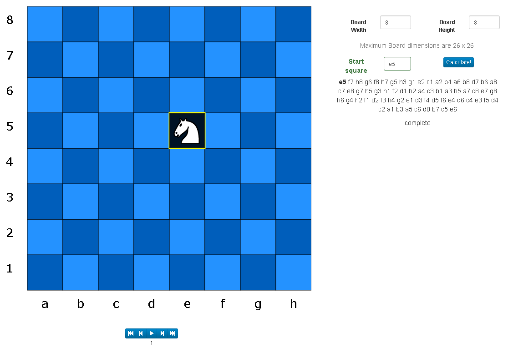

# Knights Tours #

Explore the world of Knights tours on arbitrary board sizes

## Description

This app calculates [Knight's Tours](https://en.wikipedia.org/wiki/Knight%27s_tour) on chess boards of arbitrary size up to 26 x 26 squares.
After a knight's tour has been calculated, the user can step through the Knight's path. 
Visited squares are darkened to indicate that they are no longer available to be visited again. 

The starting square can be selected by simply clicking on a square.

Additionally, the interface is responsive (by virtue of Bootstrap), and should work on small screens as well as large. 

## Live Demo
[Knight's Tours](http://knightstour.juddn.com)

This project in written in React and uses the [react-chessdiagram](https://www.npmjs.com/package/react-chessdiagram "react-chessdiagram") react component.

The Knights tours are calculated using [Warnsdorf's rule](https://en.wikipedia.org/wiki/Knight%27s_tour#Warnsdorf.27s_rule "Warnsdorf's rule") with the added "furthest from center" heuristic emplyed as a tie-breaker.

## Building this app

Clone this repository and issue an **npm install** command at the root of the folder, and then issue an **npm start** command to start

## To-do

* [X] ~~*Implement the (auto) play button (ie automatically step through the sequence when play button is presesed)*~~

* [ ] Adjustable speed for auto-play (it's fast, which is good for large boards, but a bit too zippy for small ones)

* [ ] Wait indication when calculating

* [ ] Introduce other algorithms (besides Warnsdorf's rule)

* [ ] Add the abilty to select a finishing square

* [ ] Indicate to the user if case is unsolvable (ie no complete tour possible)

* [ ] Solve closed Knight's Tours

## credit

Thanks to the authors of these react components, which are used in the app:

[react-measure](https://www.npmjs.com/package/react-measure)

[react-highlight](https://www.npmjs.com/package/react-highlight)
