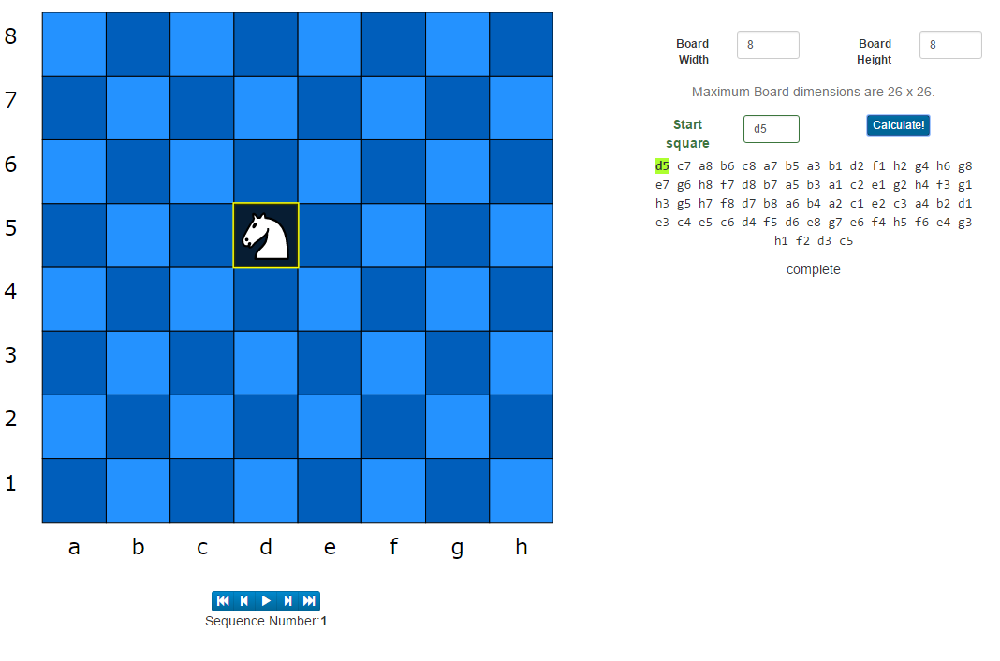

# Knights Tours #

Exploring the world of Knights tours on arbitrary board sizes

This project in written in react and uses the [react-chessdiagram](https://www.npmjs.com/package/react-chessdiagram "react-chessdiagram") react component.

The Knights tours are calculated using [Warnsdorf's rule](https://en.wikipedia.org/wiki/Knight%27s_tour#Warnsdorf.27s_rule "Warnsdorf's rule") with the added "furthest from center" heuristic emplyed as a tie-breaker.
